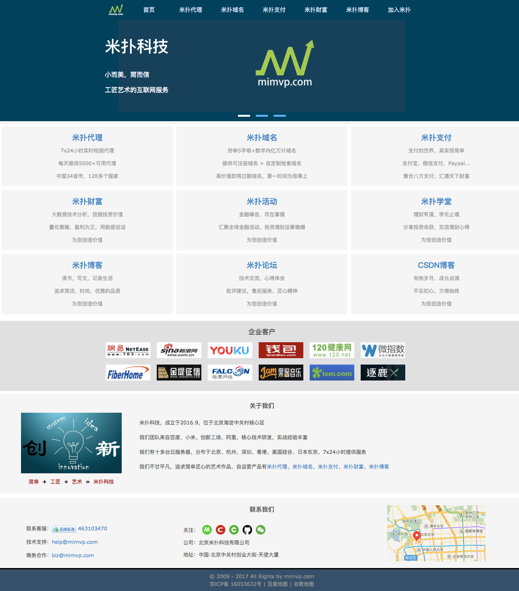
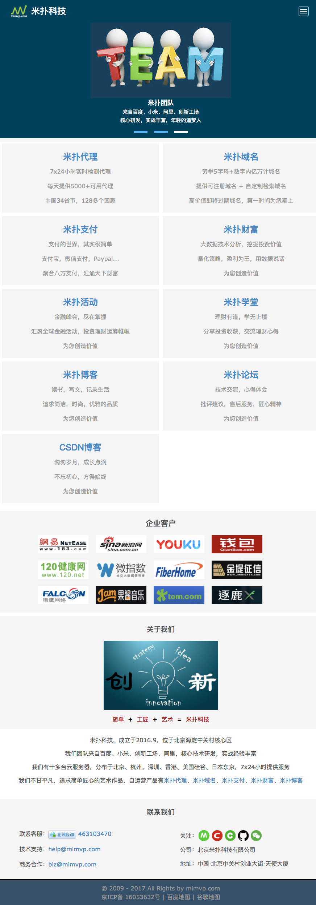

米扑科技主页（mimvp-home）
----------

mimvp-home 是米扑科技企业官网的开源项目，由北京米扑科技有限公司([mimvp.com](http://mimvp.com))原创分享。

mimvp-home 主要解决了快速搭建企业官网，灵活适配PC电脑、iPad平板、iPhone手机等多端屏幕大小的技术，分层设计页面头部、脚部、正文的模块，自动化创建sitemap网站地图等，旨在帮助中小企业快速构建自己的官方网站。

### 米扑科技官网： [http://mimvp.com](http://mimvp.com)


<br/>
<br/>


米扑官网示例
----------
### 1. PC电脑端


<br/>

### 2. iPad平板端


<br/>

### 3. iPhone手机端


<br/>
<br/>


灵活适配多屏
----------
### 1. PC电脑端
PC电脑端，宽度访问大于1280px，正文部分默认最大宽度为1200px，正好符合主流液晶大屏显示器，例如：720p(1280x720) 、WXGA(1366x768)、1080p(1920x1080)、QHD(2560x1440)等。

```css
@media(min-width:1280px) {
    .header-nav-mobile{display:none}
    
    .nav-logo {
	float: left;
	width: 60px;
	margin: 3px 0px;
	padding-left: 10%;
    }
	
    .header-nav {
	max-width: 1200px;
    }
    ......
}
```

<br/>

### 2. iPad平板端
iPad平板端，宽度访问大于640px，小于1280px，符合主流平板尺寸和低配版显示器，例如：iPad(768x1024) 、iPad Pro(1024x1366)、XGA(1024x768)、WXGA(1280x800)等低配显示器。

```css
@media(max-width:1280px) and (min-width:640px) {
    .header-nav{display:none}
    .contact-right{display:none}
    .hr-menu{display:none}
    
    .nav-logo {
	float: left;
	margin: 3px 0px;
	padding-left: 30px;
    }
    
    .col-product {
	width: 50%;
	float: left;
	line-height: 24px;
    }
    ......
}
```

<br/>

### 3. iPhone手机端
iPhone手机端，宽度访问小于640px，符合主流手机尺寸，例如：iPhone4(320x480)、Galaxy(360x640)、iPhone5(320x568)、iPhone6(375x667)、iPhone6 plus(414x736)、Nexus 6P(412x732)等手机尺寸和像素。

```css
@media(max-width:640px) {
    .header-nav{display:none}
    .contact-right{display:none}
    .hr-menu{display:none}
    
    .nav-logo {
    	float: left;
    	margin: 3px 0px;
    	padding-left: 30px;
    }
    
    .mimvp-header, .contact-item, .col-product {
    	min-width: 300px;
    }
    
    .col-product {
    	width: 100%;
    }
    ......
}
```


<br/>
<br/>


网页分层设计
----------
米扑科技主页，设计成了头部（mimvp_header.php）、正文（index.php、hr.php）、脚部（mimvp_footer.php）三层结构

这样设计的优点：结构统一、样式布局、网站统计、开发维护等，非常方便快捷。

```php
require "mimvp_header.php";

<div class="mimvp-body" id="mimvp-body">
    ......
</div>

<?php include 'mimvp_footer.php'; ?>
```

<br/>

### 1. 头部（mimvp_header.php）
头部，主要是定义meta、title、引入css 和 js，以及定义顶部导航栏、自适配PC、iPad、iPhone等多端设备。

```html
<!DOCTYPE html>
<html lang="zh-CN">
<head>
<meta charset="utf-8">
<meta http-equiv="Content-Type" content="text/html; charset=utf-8">
<meta http-equiv="X-UA-Compatible" content="IE=edge,chrome=1">
<meta http-equiv="Cache-Control" content="no-transform"> 
<meta http-equiv="Cache-Control" content="no-siteapp">
<meta name="viewport" content="width=device-width,initial-scale=1.0,minimum-scale=1.0,maximum-scale=1.0,user-scalable=no" />
<meta name="applicable-device" content="pc,mobile" />
<meta name="format-detection" content="telephone=no" />
<meta name="renderer" content="webkit" />
<title><?php 
@$reqUrl = $_SERVER ['PHP_SELF'];
if (strpos ( $reqUrl, 'index.php' ) > 0) {
	echo "米扑科技 - 简单可信赖";
} else if (strpos ( $reqUrl, 'hr.php' ) > 0) {
	echo "加入米扑 - 米扑科技";
} else if (strpos ( $reqUrl, 'price.php' ) > 0) {
	echo "米扑科技 - 简单可信赖";
}?>
</title>
<meta name="description" content="米扑科技，小而美、简而信，工匠艺术的互联网服务。" />
<meta name="keywords" content="米扑科技,米扑,mimvp.com,mimvp,米扑代理,米扑域名,米扑财富,米扑支付,米扑活动,米扑学堂,米扑博客,米扑论坛,小而美,简而信,简单可信赖" />
<meta name="author" content="米扑科技" />
<meta name="version" content="mimvp-home-1.2" />
<meta name="copyright" content="2009-<?php echo date('Y');?> by mimvp.com">
<meta name="baidu_union_verify" content="e96a0aa7da8576ac943bfc70cc713b17">
<meta name="baidu_union_verify" content="20be1643a0f542b29d54e5137bea4225" />
<meta name="baidu-site-verification" content="pzH9C12mmf" />
<meta name="sogou_site_verification" content="QCi6brPm84" />
<meta name="360-site-verification" content="d42818ef57d4f110b6c1fdf268c8cb07" />
<meta name="shenma-site-verification" content="f85fa0493059ca7e6b73ad5ae44751ec_1498128383"/>
<meta name="google-site-verification" content="DSE-4k0kg0zlz8aGyKmZImOoTkpiIreULTsgMwNqJYE" />
<meta name="msvalidate.01" content="7B03EDC84171290ABCCF8E6F2DA645B1" />
<meta name="baiduspider" content="index,follow" />
<meta name="googlebot" content="index,follow" />
<meta name="bingbot" content="index,follow" />
<meta name="robots" content="index,follow" />
<link rel="icon" href="/favicon.ico">
<link rel="stylesheet" href="/css/mimvp-1.0.5.min.css">
</head>
....
```

<br/>


### 2. 正文（index.php、hr.php）
正文，显示网页的主要内容，例如：产品介绍、产品价格、企业客户、客户服务等信息。

```php
require "mimvp_header.php";

<div class="mimvp-body" id="mimvp-body">
    ......
</div>

<?php include 'mimvp_footer.php'; ?>
<script type="text/javascript" src="/js/mimvp-1.0.5.min.js"></script>

</body>
</html>
```

<br/>


### 3. 脚部（mimvp_footer.php）
底部，主要是加载网站统计代码、包含企业版权、引入不重要的js、插入网站地图等。

```html
<div class="mimvp-footer">
	<div class="allright">
		© 2009 - <?php echo date("Y"); ?> All Rights by <a href="/">mimvp.com</a>
	</div>
	<div class="sitemap" id="sitemap">
		京ICP备 <a target="_blank" href="http://www.beianbeian.com/s?keytype=1&q=京ICP备16053632号">16053632号</a>
		 | 
		<a target="_blank" href="sitemap.xml">百度地图</a>
		 | 
		<a target="_blank" href="sitemap.html">谷歌地图</a>
		
		<!-- baidu tongji -->
		<script>
		var _hmt = _hmt || [];(function(){var hm = document.createElement("script");hm.src = "https://hm.baidu.com/hm.js?2470f08b0a4e8514a3d12a6446dmimvp";var s = document.getElementsByTagName("script")[0];s.parentNode.insertBefore(hm, s);})();
		</script>
		<!-- umeng tongji -->
		<span style="display: none; width:0px; height: 0px; padding-left: 20px;">
		<script type="text/javascript">var cnzz_protocol = (("https:" == document.location.protocol) ? " https://" : " http://");document.write(unescape("%3Cspan id='cnzz_stat_icon_1262206739'%3E%3C/span%3E%3Cscript src='" + cnzz_protocol + "s22.cnzz.com/z_stat.php%3Fid%3D1262206739%26show%Mimvp' type='text/javascript'%3E%3C/script%3E"));</script>
		</span>
	</div>
</div>
```

<br/>
<br/>


创建网站地图
----------
mimvp-home 项目里，包含两个文件：sitemap.php 和 sitemap.xsi

##### 1. sitemap.php 创建生成 sitemap.xml 文件

##### 2. sitemap.xsi + sitemap.xml 创建生成 sitemap.html 文件

sitemap 创建网站地图，详见米扑科技的开源项目 : [mimvp-sitemap-php](https://github.com/mimvp/mimvp-sitemap-php)

<br/>

### 1. 生成 sitemap.xml 文件

##### 全局变量配置
```php
// 全局变量，G开头
$GCONFIG = array("domain"=>"http://mimvp.com",
		"xmlfile"=>"sitemap",
		"htmlfile"=>"sitemap.html",
		"xslfile"=>"sitemap-xml.xsl",
		"isopen_xmlfile"=>true,
		"isopen_htmlfile"=>true,
		"isscanrootpath"=>true,
		"isxsl2html"=>true,
		"isschemamore"=>true);
```

##### 生成 sitemap.xml 文件
```php
createSitemap();	// 主函数

/**
 * 创建sitemap.xml
 * @param array $itemsArray2
 */
function createSitemap() {
	global $GCONFIG;
	global $GIncludeArray;
	global $GExcludeArray;
	global $GPriorityArray;
	
	//  是否扫描当前根目录
	$scanRootPathArray = array();
	if($GCONFIG['isscanrootpath']) {
		$scanRootPathArray = scanRootPath();
		var_dump($scanRootPathArray);
	}
	// 合并多个数组
	$itemsArray2 = mergeItems($GIncludeArray, $GExcludeArray, $scanRootPathArray);
	
	$sitemap = new Sitemap($GCONFIG['domain']);			// http://mimvp.com
	$sitemap->setXmlFile($GCONFIG['xmlfile']);			// 设置xml文件（可选）
	$sitemap->setDomain($GCONFIG['domain']);			// 设置自定义的根域名（可选）
	$sitemap->setIsChemaMore($GCONFIG['isschemamore']);	// 设置是否写入额外的Schema头信息（可选）
	
	
	// 生成sitemap item
	$idx = 0;
	foreach ($itemsArray2 as $item) {
		$idx += 1;
		echo "$idx  ---  $item<br>";
		$priority = $GPriorityArray[substr_count($item, "/")];
		$sitemap->addItem($item, $priority, "daily", time());
	}
	
	$sitemap->endSitemap();
	
	// 是否打开生成的文件： sitemap.xml
	if($GCONFIG['isopen_xmlfile']) {
		echo "<script>window.open('".$sitemap->getCurrXmlFileFullPath()."')</script>";
		echo "<br>Create sitemap.xml Success";
	}
	
	// 是否xml转html文件
	if($GCONFIG['isxsl2html']) {
		createXSL2Html($sitemap->getCurrXmlFileFullPath(), $GCONFIG['xslfile'], $GCONFIG['htmlfile']);
	}
	
	// 是否打开生成的文件 sitemap.html
	if($GCONFIG['isopen_htmlfile']) {
		echo "<script>window.open('".$GCONFIG['htmlfile']."')</script>";
		echo "<br>Create sitemap.html Success";
	}
}
```

<br/>

### 2. 生成 sitemap.html 文件
```php
/**
 * 转化 xml + xsl 为 html 
 * @param unknown $xmlFile		sitemap.xml 源文件
 * @param unknown $xslFile		sitemap-xml.xsl 源文件
 * @param unknown $htmlFile		sitemap.html 生成文件
 * @param string $isopen_htmlfile	是否打开生成文件 sitemap.html
 */
function createXSL2Html($xmlFile, $xslFile, $htmlFile, $isopen_htmlfile=false) {
	
	header("Content-Type: text/html; charset=UTF-8");
	$xml = new DOMDocument();
	$xml->Load($xmlFile);
	$xsl = new DOMDocument();
	$xsl->Load($xslFile);
	$xslproc = new XSLTProcessor();
	$xslproc->importStylesheet($xsl);
// 	echo $xslproc->transformToXML($xml);
	
	$f = fopen($htmlFile, 'w+');
	fwrite($f, $xslproc->transformToXML($xml));
	fclose($f);
	
	// 是否打开生成的文件 sitemap.html
	if($isopen_htmlfile) {
		echo "<script>window.open('".$htmlFile."')</script>";
		echo "<br>Create sitemap.html Success";
	}
}
```

<br/>


### 3. 地图示例（sitemap）

* 米扑科技 sitemap.xml : [http://mimvp.com/sitemap.xml](http://mimvp.com/sitemap.xml)

* 米扑科技 sitemap.html : [http://mimvp.com/sitemap.html](http://mimvp.com/sitemap.html)

* 米扑代理 sitemap.xml : [http://proxy.mimvp.com/sitemap.xml](http://proxy.mimvp.com/sitemap.xml)

* 米扑代理 sitemap.html : [http://proxy.mimvp.com/sitemap.html](http://proxy.mimvp.com/sitemap.html)


<br/>
<br/>


技术细节知识
----------

### 细节1. 顶部菜单导航

由于PC电脑端和iPad/iPhone移动端的顶部菜单导航样式不一样，为了便于维护，分别做了两套菜单导航，通过@media检测宽度切换

##### 电脑端菜单导航
```html
<nav class="header-nav">
	<div class="nav-logo">
    	<a href="/">
			
  		</a>
	</div>
	<div class="nav-title">
		<ul id="nav-ul"> 
			<li> 
				<a class="header-nav-item" href="/">首页</a> 
			</li>
			<li> 
				<a class="header-nav-item" target="_blank" href="http://proxy.mimvp.com">米扑代理</a> 
			</li>
			<li> 
				<a class="header-nav-item" target="_blank" href="http://domain.mimvp.com">米扑域名</a> 
			</li>
			<li> 
				<a class="header-nav-item" target="_blank" href="http://pay.mimvp.com">米扑支付</a> 
			</li>
			<li> 
				<a class="header-nav-item" target="_blank" href="http://money.mimvp.com">米扑财富</a> 
			</li>
			<li> 
				<a class="header-nav-item" target="_blank" href="http://blog.mimvp.com">米扑博客</a> 
			</li>
			<li> 
				<a class="header-nav-item" href="/hr.php">加入米扑</a> 
			</li>
		</ul> 
	</div> 
	<div class="nav-clear"></div>
</nav>
```

##### 移动端菜单导航
```html
<nav class="header-nav-mobile">
	<div class="nav-logo">
    	<a href="/">
			
  		</a>
	</div>
	<div class="nav-title">
		<ul id="nav-ul"> 
			<li> 
				<a class="header-nav-item header-nav-item-mimvp" href="/">米扑科技</a> 
			</li>
			<li style="float: right;"> 
				<a id="hidemenu-btn" class="hidemenu-btn header-nav-item" href="#" onclick="hidemenu_btn_click()">
					 <div class="hidemenu-icon">
						 <span class="icon-bar"></span>
						 <span class="icon-bar"></span>
						 <span class="icon-bar"></span>
					 </div>
				</a> 
				<ul id="hidemenu" class="hidemenu" style="display: none;"> 
					<a class="header-nav-item" target="_blank" href="http://proxy.mimvp.com">米扑代理</a> 
					<a class="header-nav-item" target="_blank" href="http://domain.mimvp.com">米扑域名</a> 
					<a class="header-nav-item" target="_blank" href="http://pay.mimvp.com">米扑支付</a> 
					<a class="header-nav-item" target="_blank" href="http://money.mimvp.com">米扑财富</a>
					<a class="header-nav-item" target="_blank" href="http://blog.mimvp.com">米扑博客</a> 
					<a class="header-nav-item" href="/hr.php">加入米扑</a> 
				</ul> 
			</li> 
		</ul> 
	</div> 
	<div class="nav-clear"></div>
</nav>
```

##### @media宽度切换
```css
/* PC电脑端，隐藏移动端的菜单导航 */
@media(min-width:1280px) {
    .header-nav-mobile{display:none}
}

/* 移动端，隐藏PC电脑端的菜单导航 */
@media(max-width:1280px) and (min-width:640px) {
    .header-nav{display:none}
}

/* 移动端，隐藏PC电脑端的菜单导航 */
@media(max-width:640px) {
    .header-nav{display:none}
}
```


<br/>


### 细节2. 米扑产品布局
米扑产品布局，PC端为3列，iPad平板端为2列，iPhone手机端为1列，全部通过@media宽度切换

```css
/* PC端为3列 */
@media(min-width:1280px) {
	.col-product {
	    width: 33.33%;
	    float: left;
	    line-height: 24px;
	}
}

/* iPad平板端为2列 */
@media(max-width:1280px) and (min-width:640px) {
	.col-product {
	    width: 50%;
	    float: left;
	    line-height: 24px;
	}
}

/* iPhone手机端为1列 */
@media(max-width:640px) {
	.col-product {
	    width: 100%;
	}
}
```

<br/>


### 细节3. 企业客户布局
企业客户布局，企业客户图标总有12个，PC端为2行6列，iPad平板端为3行4列，iPhone手机端为6行2列，全部通过@media切换宽度和高度

```css
/* PC端为2行6列 */
@media(min-width:1280px) {
	.client-friends {
	    height: 220px;
	    background-color: #f5f5f5;
	}
	
	.friend-links {
	    width: 1000px;
	}
	
	.client-friends ul.friend-links li {
	    float: left;
	    margin: 10px 10px;
	    line-height: 1.5em;
	    display: list-item;
	}
}

/* iPad平板端为3行4列 */
@media(max-width:1280px) and (min-width:640px) {
	.client-friends{
	    height: 280px;
	    background-color: #f5f5f5;
	}
	
	.friend-links {
	    width: 700px;
	}
	
	.client-friends ul.friend-links li {
	    float: left;
	    margin: 10px 10px;
	    line-height: 1.5em;
	    display: list-item;
	}
}

/* iPhone手机端为6行2列 */
@media(max-width:640px) {
	.client-friends {
	    height: 490px;
	    background-color: #f5f5f5;
	}
	
	.friend-links {
	    width: 300px;
	}
	
	.client-friends ul.friend-links li {
	    float: left;
	    margin: 10px 5px;
	    line-height: 1.5em;
	    display: list-item;
	}
}
```

<br/>


### 细节4. 关注图标布局

米扑科技主页下方的"联系我们"的关注图标，需要自己通过Photoshop进行切图，并贴上链接，小图标美观，最有成就感的！
```html
<div class="about contact_us" style="margin-top:10px; line-height: 36px;">
	<div style="float: left;">关注：</div>
	<div class="about contact_us" style="float: left; line-height: 30px; vertical-align: middle;">
		<a target="_blank" href="http://blog.mimvp.com"><i></i></a> 
		<a target="_blank" href="http://blog.csdn.net/ithomer"><i></i></a>
		<a target="_blank" href="http://git.oschina.net/mimvp_admin"><i></i></a>
		<a target="_blank" href="https://github.com/mimvp"><i></i></a>
		<a><i></i></a>
	</div>
	<div class="nav-clear"></div>
</div>
```

<br/>


### 细节5. 舍弃地图位置
米扑科技主页下方的"联系我们"的地图位置，在iPad平板和iPhone手机端，都不好布局显示，引起不重要，故直接舍弃。

<br/>


### 细节6. 压缩css和js
通常在开发时，css和js文件需要格式化，方便查看代码逻辑；一旦发布到线上，最好压缩混淆css和js
css和js，最好加上版本号，一来方便代码维护，二来解决客户端浏览器缓存的问题

米扑科技设计的css和js规范：

* css/mimvp-1.0.1.css               // 开发用

* css/mimvp-1.0.1.min.css         // 线上用

* js/mimvp-1.0.1.js                   // 开发用

* js/mimvp-1.0.1.min.js             // 线上用


<br/>      
<br/>      
	

米扑科技
----------


<a href="http://mimvp.com" target="_blank">http://mimvp.com</a>

